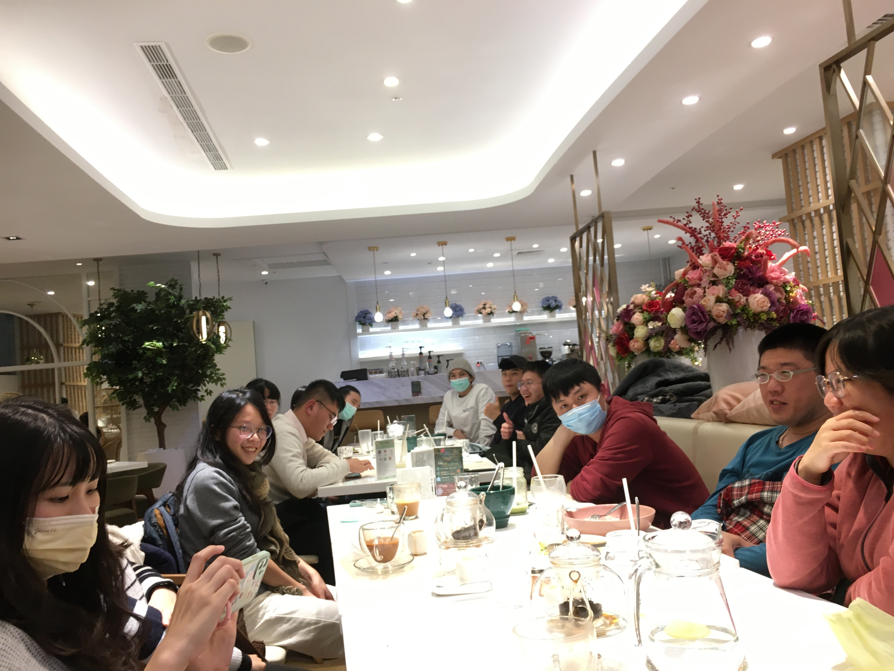
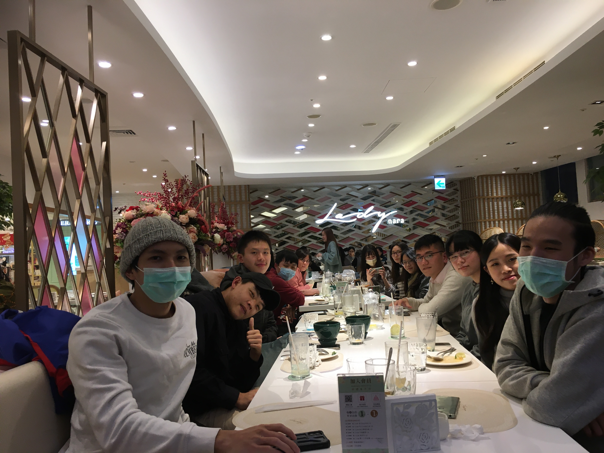

<map name="image-map1">
    <area target="" alt="柯雅婷" title="柯雅婷" coords="517,0,1336,726" shape="rect">
    <area target="" alt="吳亦烜" title="吳亦烜" coords="1599,826,1440,630" shape="rect">
    <area target="" alt="唐聖凱" title="唐聖凱" coords="1585,880,1795,1103" shape="rect">
    <area target="" alt="柯秉豐" title="柯秉豐" coords="2138,1136,1971,977" shape="rect">
    <area target="" alt="黃友聞" title="黃友聞" coords="2049,1191,2213,1358" shape="rect">
    <area target="" alt="陳佳茵" title="陳佳茵" coords="2360,1255,2510,1437" shape="rect">
    <area target="" alt="郭立園" title="郭立園" coords="2556,1695,2317,1465" shape="rect">
</map>

<map name="image-map2">
    <area target="" alt="黃育萱" title="黃育萱" coords="4020,2096,3713,1373" shape="rect">
    <area target="" alt="王廣鈞" title="王廣鈞" coords="3706,1922,3389,1437" shape="rect">
    <area target="" alt="唐聖凱" title="唐聖凱" coords="2456,1633,2762,1950" shape="rect">
    <area target="" alt="蔡秉言" title="蔡秉言" coords="2345,1845,2452,1642" shape="rect">
    <area target="" alt="李育鴻" title="李育鴻" coords="2242,1592,2342,1781" shape="rect">
    <area target="" alt="吳亦烜" title="吳亦烜" coords="2150,1779,1989,1605" shape="rect">
    <area target="" alt="黃友聞" title="黃友聞" coords="1630,1731,1533,1891" shape="rect">
    <area target="" alt="劉孝謙" title="劉孝謙" coords="1327,1722,1534,1968" shape="rect">
    <area target="" alt="劉又銜" title="劉又銜" coords="1280,1705,1142,1865" shape="rect">
    <area target="" alt="謝佩君" title="謝佩君" coords="899,1872,1227,2093" shape="rect">
    <area target="" alt="蕭家恩" title="蕭家恩" coords="472,1786,13,2584" shape="rect">
</map>

<map name="image-map3">
    <area target="" alt="黃友聞" title="黃友聞" coords="3963,1378,3464,1955" shape="rect">
    <area target="" alt="孫梓云" title="孫梓云" coords="3218,1549,3457,1927" shape="rect">
    <area target="" alt="劉又銜" title="劉又銜" coords="2972,1524,3211,1857" shape="rect">
    <area target="" alt="劉孝謙" title="劉孝謙" coords="2766,1555,2976,1857" shape="rect">
    <area target="" alt="謝佩君" title="謝佩君" coords="2684,1665,2766,1829" shape="rect">
    <area target="" alt="柯雅婷" title="柯雅婷" coords="2609,1615,2687,1761" shape="rect">
    <area target="" alt="蕭家恩" title="蕭家恩" coords="2410,1630,2538,1783" shape="rect">
    <area target="" alt="黃育萱" title="黃育萱" coords="2085,1806,1986,1674" shape="rect">
    <area target="" alt="唐聖凱" title="唐聖凱" coords="1843,1674,1982,1859" shape="rect">
    <area target="" alt="蔡秉言" title="蔡秉言" coords="1590,1534,1811,1822" shape="rect">
    <area target="" alt="李育鴻" title="李育鴻" coords="1805,1836,1516,2124" shape="rect">
    <area target="" alt="吳亦烜" title="吳亦烜" coords="803,1437,1298,2007" shape="rect">
</map>

# PI
**郭立園 Li-Yaung Kuo** (2019~present)
> I am particularly interested in phylogenetics and evolutionary issues of ferns!
> https://www.researchgate.net/profile/Li-Yaung-Kuo

## Research Assistant 

**劉恩 En Liu** (2025~present) 
> 過去研究主題圍繞在耳蕨屬的經典分類，喜歡蕨類但極度偏好耳蕨跟有耳蕨的高山。
> 目前在實驗室做一些分生與細胞學實驗，以及寫分類文章～希望以後能不要只做分類～

**藍世裕 Charles Lan** (2025)

**謝佩君 Pei-Jun Xie** (2021~2024)
  我是助理姐姐，負責管理實驗室大小事和大部分的分子實驗，同時學習成為一位植物學家。
  對我而言，蕨類與石松類的形態與演化一直是非常有趣的議題，在這裡我也運用我的解剖專長探究三叉蕨兩型葉的形態差異。

**黃育萱 Yu-Hsuan Huang** (2021)

**柯雅婷** (2019~2020)
  我是萃取了上百種蕨類DNA和RNA卻認不出任何一種蕨類的分生技術專員。

**蕭家恩** (2018)

## Ph.D. Student

**林耀傑	Ponpipat Limpanasittichai นาย** (2024~present)
  我超喜歡蕨類，但我更喜歡咖啡。

**黃友聞	You-Wun Hwang** (2020~present)
  頭上快長三叉蕨的研究生。

## Master Student

**賴昱蓉	Yu-Jung Lai** (2025~present)
  以蕨類孢子，破解身分之謎，找出它到底是誰！

**劉又銜 You-Xian Liu** (2024~present) From 2021 undergraduate students
  目前正在研究蕨類的性別調控機制，促精素系統。
  我曾經在腦海中想像這種避免自交、增進遺傳多樣性的機制，要是擬人化後的情況。
  後來發現，人類的倫理道德還是不要套用到蕨類身上會比較好。

**王于嘉 Yoga** (2023~present) From 2022 undergraduate students
  抓蕨類背面的蟲蟲回實驗室，關心他們是誰。

**李育鴻** (2022~present)
  地耳蕨小幫手，蝸刮刮刮刮蝸瓜瓜，兼職新手農夫、蝸牛愛好者，穿越到大一重新開始的大四時空旅人

**陳筠Yun Chen** (2022~2025)
  探索瓶爾小草與真菌之間的微妙關係，也做了一些瓶爾小草亞科之間的分類議題，並在畢業後兼任實驗室的室內裝修師與網路IT工程師。

**吳亦烜 Yi-Hsuan Wu** (2021~2024) From 2019 undergraduate students
  曾經是設計了一套probes，為了探索台灣羅蔓藤蕨獨立配子體的起源而四處採集的前碩四生。
  現在則是在生資領域中做工，整天看著電腦聽著打字聲。

**黃育萱 Yu-Hsuan Huang** (2021～2023)
  跟溪邊蕨和聖蕨類群一起打滾了近十年，才終於從他們身上得到學位！一開始沒想到這個類群居然這麼複雜，
  原本認知的被推翻，還經歷了屬名搬動，甚至還有很多新東西，目前努力整理後續資料中！（喜歡土匪兔和吉掰兔，歡迎給我週邊（欸））

**唐聖凱 Shengkai Tang** (2021~present)

**Alexandria Quinlan** (2020~2022)
I have a special fervor for ferns, and other spore producing organisms. I am particularly interested in ecological assocations, such as ferns growing on tree ferns, moss growing on tree ferns, algae growing on tree ferns, fungi growing on tree ferns... if I could, I would also grow on a tree fern.

## Undergrads

2021
**劉孝謙**
想知道槲蕨腐植質蒐集葉以及營養葉的差異的迷糊大學生

**蔡秉言**
醫科24級，無融合生殖相關研究，植物學新手((狡兔已經好幾窟了，除了生科院與宿舍外還不定時出沒在厚德、載物書院、台達與電資館

2020
**孫梓云**
拿著顏料畫筆在實驗室不務正業的蕨蕨標本繪圖仔：Ｄ

2021
**陳彥臻**
蕨類研究室養蟲子是否搞錯了什麽？

# Alumni

**柯秉豐**

**陳佳茵**

## Web Developer (IT)

**王廣鈞**
  printf("社會底層小角落的一位繳稅人士，監督某570b7acb大學生科研究費轉化成果效益");

**詹元耀**
  "我愛地球"

